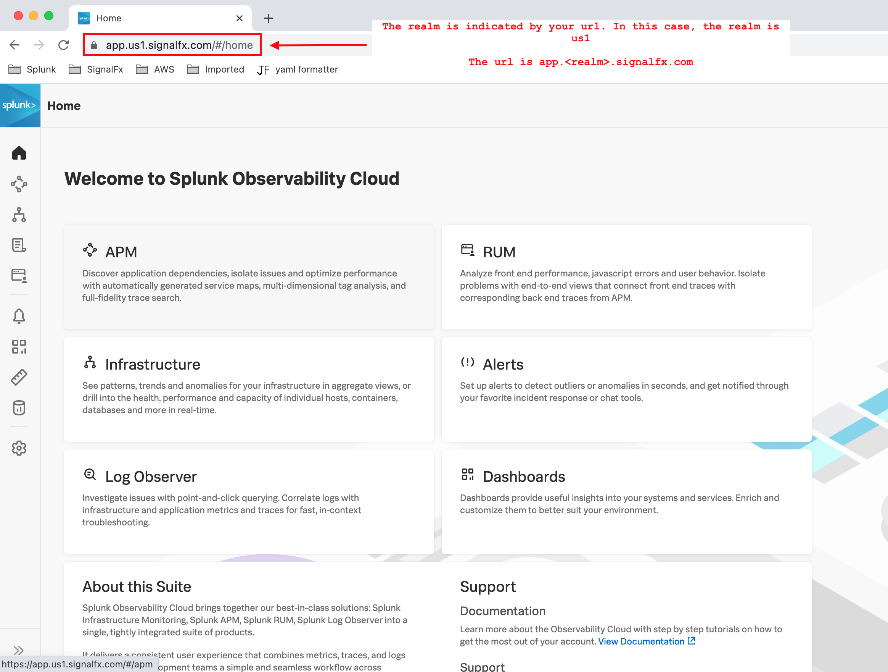
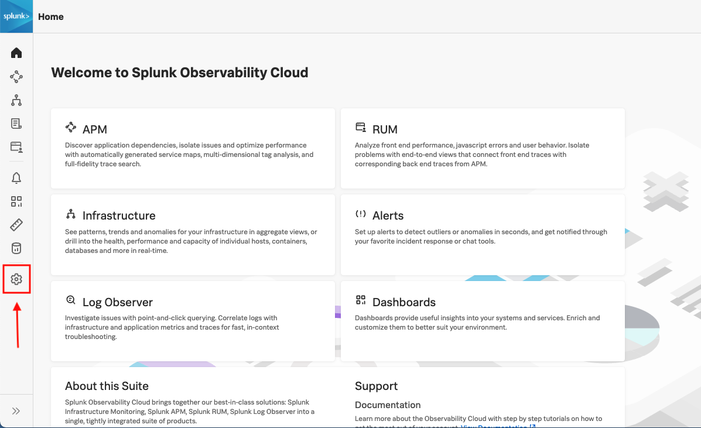
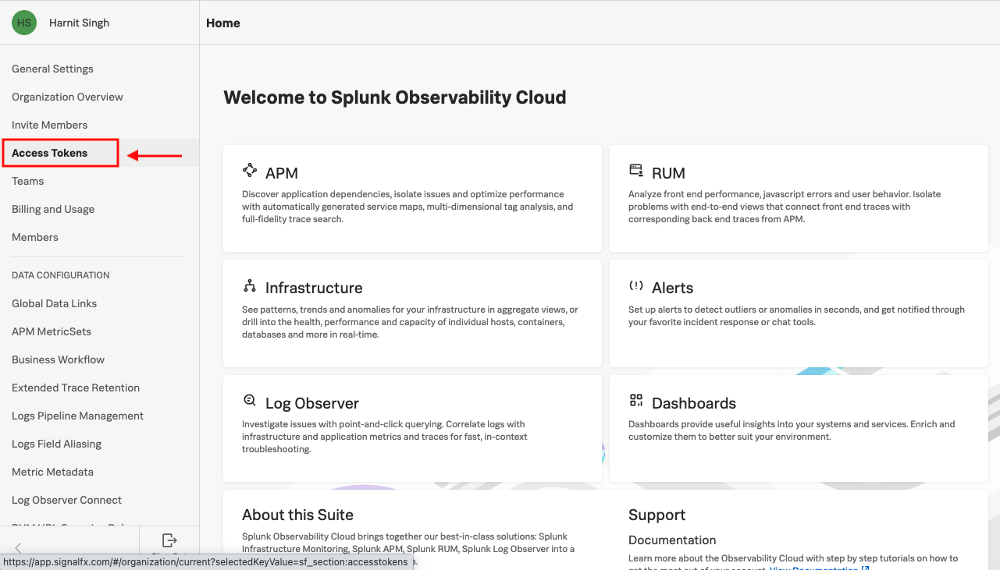
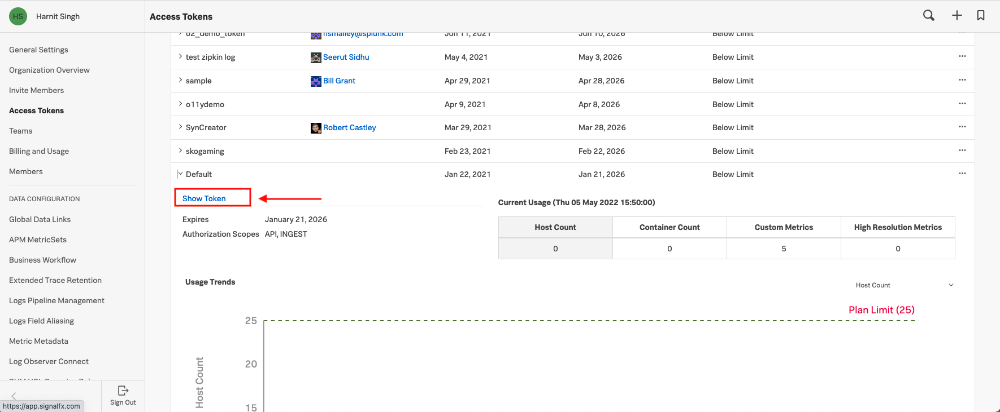

## APM Preparation

---

### Prep Step 1: Log in to your Splunk Observability account to identify token/realm  

Check your [Splunk Observability Account](https://app.us1.signalfx.com/o11y/#/home) (your welcome email has this link) and identify your TOKEN and REALM- these are available in the profile menu in your Splunk Observability account. Note that the realm component i.e. `us1` may be different for your account based on how you signed up.

How to find realm:

`Splunk Observability Url -> Find your realm https://app.<realm>.signalfx.com`    

  

How to find token:  
1. Click on the gear icon on the left nav bar
  

2. Click on Access Tokens
  

3. Select an access token (such as Default) and click Show Token and note the value
  

---

### Prep Step 2: Choose/ Create Lab Environment  

Splunk Observability is for **server environments**.    

This workshop uses **Ubuntu Linux** as the server environment.    
You can use any Ubuntu platform- bare metal, VM, or cloud VM.

You can choose an existing Ubuntu machine that you have or create or you can follow our guide below to make an Ubuntu VM on your Mac / Windows PC.  
If you chose your own Ubuntu machine, you can set it up with the Workshop software with this command: 

Setup Ubuntu

```
bash <(curl -s https://raw.githubusercontent.com/harnitsignalfx/apmworkshop/master/setup-tools/ubuntu.sh)
```

Update the path

```
source /home/ubuntu/.bashrc
```


#### Guide: Create an Ubuntu Linux environment on a Mac or PC and install the necessary software components:

#### <ins>Mac</ins>

**#1 Install Brew**  

Install [brew package manager](https://brew.sh):  

```
/bin/bash -c "$(curl -fsSL https://raw.githubusercontent.com/Homebrew/install/HEAD/install.sh)"
```

Make sure `brew` is fully upgraded: `brew upgrade`

Results should be at least 1.5:

```
brew --version
```

**#2 Install Multipass**

We will use [Multipass](https://multipass.run) as a hypervisor for Mac: 

Install Multipass: 

```
brew cask install multipass
```

If needed, further instructions are here: https://multipass.run/docs/installing-on-macos

Do one final brew upgrade before spinning up VM: 

```
brew upgrade
```

#### <ins>Windows</ins>  

Follow Multipass Windows installation instructions: https://multipass.run/docs/installing-on-windows

**#3 Launch Multipass Ubuntu VM**

Create your VM called "primary":  

```
multipass launch -n primary
```

This will download Ubuntu and may take a few minutes the first time.

Basic multipass commands:  
Shell into VM: `multipass shell primary`  
Exit VM: `exit`

To manage multipass VM:  
`multipass stop primary` stops the VM  
`multipass delete primary` deletes the VM from the hypervisor  
`multipass purge` purges created images but leaves the ubuntu template intace  

**#4 Install Lab Software On Ubuntu VM**

A bootstrap script will install everything needed and clone this repo.  
This will take up to 10 minutes to execute- leave it running until complete.  

```
multipass shell primary 
```

Once in your Multipass Ubuntu VM:

Setup Ubuntu

```
bash <(curl -s https://raw.githubusercontent.com/signalfx/apmworkshop/master/setup-tools/ubuntu.sh)
```

Update the path

```
source /home/ubuntu/.bashrc
```

---

[Return to workshop](../README.md)

Next Step (2): [Install Splunk OpenTelemetry Collector Agent on an Ubuntu host](./2-otelagent.md)
